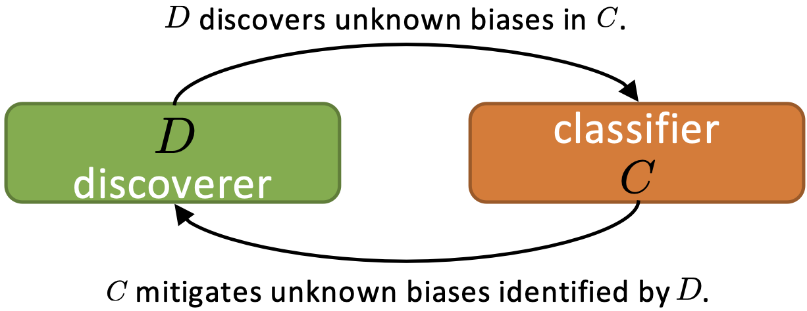
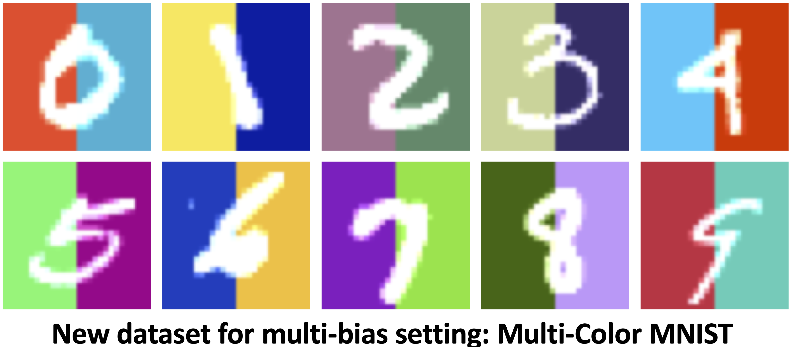

# Discover and Mitigate Unknown Biases with Debiasing Alternate Networks [ECCV 2022]

[Zhiheng Li](https://zhiheng.li/), [Anthony Hoogs](https://www.kitware.com/anthony-hoogs/), [Chenliang Xu](https://www.cs.rochester.edu/~cxu22/)

University of Rochester, Kitware, Inc.

**Contact**: Zhiheng Li (email: zhiheng.li@rochester.edu, homepage: https://zhiheng.li)



**TL;DR**: We introduce Debiasing Alternate Networks (DebiAN) to discover and mitigate unknown biases of an image classifier. DebiAN alternately trains two networks—a *discover* and a *classifier*. *Discoverer* actively identifies *classifier*’s unknown biases. At the same time, the *classifier* mitigates the biases identified by the *discoverer*.

## Multi-Color MNIST Dataset



In this work, we propose the Multi-Color MNIST dataset to better benchmark debiasing methods under the *multi-bias* setting. It contains two bias attributes—left color and right color.

### Download and Untar Multi-Color MNIST Dataset

```
cd data

wget https://github.com/zhihengli-UR/DebiAN/releases/download/v1.0/multi_color_mnist.tar.gz -O multi_color_mnist.tar.gz

tar xvzf multi_color_mnist.tar.gz

```

### Generate Multi-Color MNIST Dataset

If you want to generate other bias-aligned ratio combinations between left color and right color bias attributes, you can use the following command:

```bash
bash scripts/make_multi_color_mnist.sh
```

## Data Preparation

Put each dataset in a folder under the `data` directory as follows:

```bash
data
├── bar
├── bffhq
├── celeba
├── lsun
├── multi_color_mnist
└── places365
```

**Biased Action Recognition (BAR)**: download BAR dataset from [here](https://github.com/alinlab/BAR) and unzip it to `data/bar`

**bFFHQ**: download bFFHQ dataset from [here](https://drive.google.com/drive/folders/1JEOqxrhU_IhkdcRohdbuEtFETUxfNmNT?usp=sharing) and unzip it to `data/bffhq`

**CelebA**: download CelebA dataset from [here](https://github.com/switchablenorms/CelebAMask-HQ) and unzip it to `data/celeba`

**LSUN**: download the LSUN dataset from [here](https://github.com/fyu/lsun) and unzip it to `data/lsun`

**Places365**: download the Places365 dataset from [here](http://places2.csail.mit.edu/download.html) and unzip it to `data/places365`

## Dependencies

pytorch

torchvision

lmdb

imageio

## Training and Evaluation

```bash
bash scripts/${DATASET_NAME}_debian.sh  # ${DATASET_NAME} = bar, bffhq, celeba_blond, celeba_gender, multi_color_mnist, or scene
```

## Add your method

This code base can be used to add future methods for training and evaluation. To achieve that, simply create a new Trainer class for your method that inherits the `BaseTrainer` class in each experiment folder (e.g., `bffhq_exp`).

## Citation

Please cite our work if you use DebiAN or the Multi-Color MNIST dataset.

```
@inproceedings{Li_2022_ECCV,
  title = {Discover and {{Mitigate Unknown Biases}} with {{Debiasing Alternate Networks}}},
  booktitle = {The {{European Conference}} on {{Computer Vision}} ({{ECCV}})},
  author = {Li, Zhiheng and Hoogs, Anthony and Xu, Chenliang},
  year = {2022}
}
```
